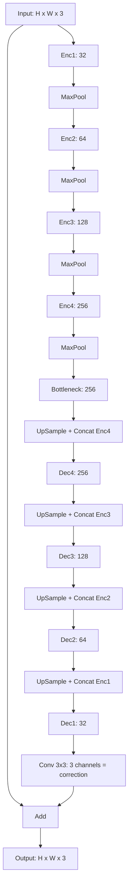

<div align="center">

# 🔍 PixelBoost

### Deep Learning Image De-Pixelation with a Residual U-Net

Turn blocky, pixelated images back into clear, detailed ones.

[](https://colab.research.google.com/drive/1e_80IPMaX17w40zAi2T-XCIqUq96KDNH?usp=sharing)


</div>

---

## 📑 Table of Contents

1. [Overview](#-overview)
2. [Run in Google Colab](#-run-in-google-colab)
3. [Results](#-results)
4. [Model Architecture](#-model-architecture)
5. [Training Settings](#-training-settings)
6. [Loss Function](#-loss-function)
7. [Dataset](#-dataset)
8. [Project Structure](#-project-structure)
9. [Installation](#-installation)
10. [Usage](#-usage)
11. [Metrics](#-metrics)
12. [Future Work](#-future-work)

---

## ✨ Overview

**PixelBoost** repairs pixelated images. It takes a blocky image and returns a cleaner image of the **same size**.

The model is a **Residual U-Net** with **5,203,299 parameters**. It learns only the *correction* and adds it to the input image, so training is faster and more stable.

> 📝 **Note:** This project does de-pixelation (fixing blocks). It does not make the image bigger.

---

## 🚀 Run in Google Colab

Click the button to open the full notebook:

[](https://colab.research.google.com/drive/1e_80IPMaX17w40zAi2T-XCIqUq96KDNH?usp=sharing)

Steps:

1. Open the notebook.
2. Turn on the GPU: **Runtime → Change runtime type → T4 GPU**.
3. Run the cells from top to bottom.

---

## 🖼️ Results

<div align="center">

| Pixelated | Model Output | Original |
|:---:|:---:|:---:|
|  |  |  |

</div>

### Metric scores

Average over the validation images (512×512 center crop). Fill in your own numbers from the evaluation cell.

| Pixel factor | Type | MSE | MAE | RMSE | PSNR (dB) | SSIM | MS-SSIM |
|:---:|:---|:---:|:---:|:---:|:---:|:---:|:---:|
| 2 | Pixelated | - | - | - | - | - | - |
| 2 | **Model** | - | - | - | - | - | - |
| 4 | Pixelated | - | - | - | - | - | - |
| 4 | **Model** | - | - | - | - | - | - |
| 8 | Pixelated | - | - | - | - | - | - |
| 8 | **Model** | - | - | - | - | - | - |
| 16 | Pixelated | - | - | - | - | - | - |
| 16 | **Model** | - | - | - | - | - | - |

---

## 🧠 Model Architecture

**Type:** Residual U-Net with 4 encoder levels, 1 bottleneck, 4 decoder levels, and an input-to-output skip.

### Data flow



### Residual block

Each block has this structure:

- **Shortcut:** Conv 1×1
- **Main path:** Conv 3×3 + ReLU, then Conv 3×3
- **Merge:** Add shortcut and main path, then ReLU

### Layer table

Shapes shown for a **128×128** input.

| Layer | Input channels | Output channels | Output shape | Parameters |
|:---|:---:|:---:|:---:|---:|
| Input | 3 | 3 | 128 × 128 × 3 | 0 |
| Enc1 (Res block) | 3 | 32 | 128 × 128 × 32 | 10,272 |
| MaxPool | 32 | 32 | 64 × 64 × 32 | 0 |
| Enc2 (Res block) | 32 | 64 | 64 × 64 × 64 | 57,536 |
| MaxPool | 64 | 64 | 32 × 32 × 64 | 0 |
| Enc3 (Res block) | 64 | 128 | 32 × 32 × 128 | 229,760 |
| MaxPool | 128 | 128 | 16 × 16 × 128 | 0 |
| Enc4 (Res block) | 128 | 256 | 16 × 16 × 256 | 918,272 |
| MaxPool | 256 | 256 | 8 × 8 × 256 | 0 |
| Bottleneck (Res block) | 256 | 256 | 8 × 8 × 256 | 1,245,952 |
| UpSample + Concat Enc4 | 256 + 256 | 512 | 16 × 16 × 512 | 0 |
| Dec4 (Res block) | 512 | 256 | 16 × 16 × 256 | 1,901,312 |
| UpSample + Concat Enc3 | 256 + 128 | 384 | 32 × 32 × 384 | 0 |
| Dec3 (Res block) | 384 | 128 | 32 × 32 × 128 | 639,360 |
| UpSample + Concat Enc2 | 128 + 64 | 192 | 64 × 64 × 192 | 0 |
| Dec2 (Res block) | 192 | 64 | 64 × 64 × 64 | 159,936 |
| UpSample + Concat Enc1 | 64 + 32 | 96 | 128 × 128 × 96 | 0 |
| Dec1 (Res block) | 96 | 32 | 128 × 128 × 32 | 40,032 |
| Correction head (Conv 3×3) | 32 | 3 | 128 × 128 × 3 | 867 |
| Add (input + correction) | 3 + 3 | 3 | 128 × 128 × 3 | 0 |
| **Total** | | | | **5,203,299** |

### Model summary

| Item | Value |
|:---|:---|
| Total parameters | 5,203,299 |
| Trainable parameters | 5,203,299 |
| Non-trainable parameters | 0 |
| Size in memory (float32) | about 19.8 MB |
| Input shape | (None, None, 3) |
| Output shape | (None, None, 3) |
| Pixel range | 0 to 1 |
| Size rule | Height and width must be divisible by 16 |

---

## ⚙️ Training Settings

| Setting | Value |
|:---|:---|
| Patch size | 128 × 128 |
| Patches per image | 10 |
| Batch size | 16 |
| Steps per epoch | 200 |
| Max epochs | 50 |
| Optimizer | Adam |
| Learning rate | 0.0002 |
| Learning rate schedule | ReduceLROnPlateau (factor 0.5, patience 3, min 0.000001) |
| Early stopping | Patience 8, restore best weights |
| Pixel factors | 2, 4, 8, 16 (random) |
| Augmentation | Horizontal flip, vertical flip, rotation (0, 90, 180, 270) |
| Validation set | 80 patches from validation images |
| Best model saved by | Lowest validation loss |

---

## 📉 Loss Function

**Loss = L1 + 0.1 × (1 − SSIM)**

| Part | Formula | Purpose |
|:---|:---|:---|
| L1 | (1/N) × Σ abs(y_true − y_pred) | Keeps pixels close to the original |
| SSIM term | 1 − SSIM(y_true, y_pred) | Keeps structure and texture |
| Weight | 0.1 | Balances the two parts |

---

## 📊 Dataset

**DIV2K** (high-quality 2K images)

| Split | Images |
|:---|:---:|
| Training | 800 |
| Validation | 100 |

Source: [DIV2K on Kaggle](https://www.kaggle.com/datasets/joe1995/div2k-dataset)

**How training pairs are made:**

1. Take a random 128×128 patch from a high-quality image.
2. Flip or rotate it.
3. Shrink it by a random factor (2, 4, 8, or 16).
4. Enlarge it back with nearest-neighbor. This makes the blocky input.
5. The original patch is the target.

---

## 📂 Project Structure

| File or folder | Description |
|:---|:---|
| `images/` | Result images for this README |
| `src/` | Source package |
| `main.py` | Main script |
| `model_creation.py` | Model building code |
| `preprosses.py` | Data loading and pixelation |
| `import.py` | Imports and setup |
| `__notebook_source__.ipynb` | Training notebook |
| `resulation.ipynb` | Testing and evaluation notebook |
| `best_model.keras` | Best saved model |
| `last_model.keras` | Last saved model |
| `requirements.txt` | Python packages |
| `pyproject.toml` | Project settings |

---

## 🛠️ Installation

**Easiest way:** use the [Colab notebook](https://colab.research.google.com/drive/1e_80IPMaX17w40zAi2T-XCIqUq96KDNH?usp=sharing). No install needed.

**On your own computer:**

Step 1. Clone the repo:

```bash
git clone https://github.com/himanshuchandrakar465/PixelBoost-Deep-Learning-Based-Image-Super-Resolution.git
```

Step 2. Go into the folder:

```bash
cd PixelBoost-Deep-Learning-Based-Image-Super-Resolution
```

Step 3. Install the packages:

```bash
pip install -r requirements.txt
```

---

## ▶️ Usage

### Train

Open the Colab notebook or `__notebook_source__.ipynb` and run the cells in order.

### Test and evaluate

Open `resulation.ipynb`. It compares the pixelated image, the model output, and the original.

### Load the saved model

```python
import tensorflow as tf

model = tf.keras.models.load_model("best_model.keras", compile=False)
```

### Predict on one image

```python
import numpy as np


def predict_image(model, img):
    h, w, _ = img.shape
    pad_h = (16 - h % 16) % 16
    pad_w = (16 - w % 16) % 16
    padded = np.pad(img, ((0, pad_h), (0, pad_w), (0, 0)), mode="reflect")
    out = model.predict(padded[None, ...], verbose=0)[0]
    return np.clip(out[:h, :w], 0, 1)
```

---

## 📏 Metrics

| Metric | Better when | Meaning |
|:---|:---:|:---|
| MSE | Lower | Average squared pixel error |
| MAE | Lower | Average absolute pixel error |
| RMSE | Lower | Square root of MSE |
| PSNR | Higher | Quality in dB (over 30 dB is good) |
| SSIM | Higher | Structure similarity (1.0 is perfect) |
| MS-SSIM | Higher | SSIM at many scales |

---

## 🔮 Future Work

- [ ] Pix2Pix GAN with a PatchGAN discriminator
- [ ] VGG perceptual loss for sharper detail
- [ ] Tile-based prediction for very large images
- [ ] Real-world damage (noise, blur, compression)
- [ ] Simple web app demo

---

## 🙏 Acknowledgements

- [DIV2K Dataset](https://data.vision.ee.ethz.ch/cvl/DIV2K/)
- U-Net: Ronneberger et al., 2015
- TensorFlow and Keras teams

---

<div align="center">

Made by **Himanshu Chandrakar**

⭐ If you like this project, give it a star!

</div>
